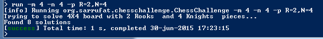

# Chess Problem #

This application is an attempt to find a general algorithm for solving a kind of mathematical chess problem known as “independence problem”, such as the Eight Queen puzzle. This algorithm tries to discover how many possible solutions exist. 

The problem consists on finding all unique configurations of a set of normal chess pieces on a chess board with dimensions M×N where none of the pieces is in a position to take any of the others. The colour of the pieces doesn't matter, and there are no pawns among the pieces.

## Running with SBT ##

The easiest way to run the program is running with sbt, the Standard Scala Built Tool. Run sbt in your project directory with no arguments. Then execute the program with the ‘run’ command.

## Command line options ##

-m <value> | --dimM <value> 
> M board dimension

 -n <value> | --dimN <value>
      
>  N board dimension

 -p k1=v1,k2=v2... where k1..kn= one of 'KQBRN' | --pieces k1=v1,k2=v2... where k1..kn= one of 'KQBRN'

 -o | --output
      
>  output results

